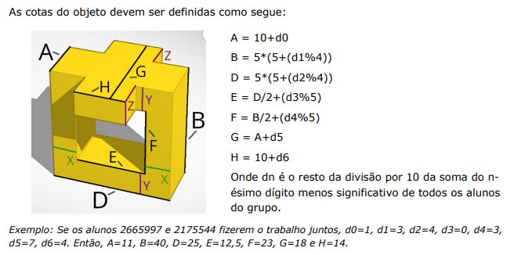

# Impressão 3D
Um programa de linha de comando feito pra calcular as dimensões e tamanhos do modelo 3D abaixo dado as fórmulas do enunciado:

<p style="text-align: center;"></p>

## Rodando
Obter os valores d*n* de 0 a 6:
```bash
$ mix run main.ex --ra1 3948395 --ra2 4959485
d0: 0
d1: 7
d2: 7
d3: 7
d4: 9
d5: 8
d6: 7
```

Obter as variáveis A, B, D, E, F, G, H calculadas:
```bash
$ mix run main.ex --ra1 3948395 --ra2 4959485 --full
A = 10
B = 40
D = 40
E = 22
F = 24
G = 18
H = 17
```
